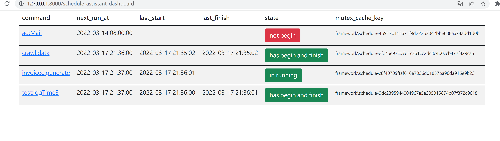

# laravel-schedule


## Requirements

- PHP ^7.1


## Installation

The preferred method of installation is to use composer:

```bash
$ composer require mattsu/scheduleassistant
```

Publish the migration and config

```bash 
php artisan vendor:publish --provider=MattSu\\ScheduleAssistant\\ScheduleAssistantServiceProviser
```

Create scheduled_assistant table

```bash
$ php artisan migrate
```

Clear Schedule Mutex
```bash
$ php artisan command:clearScheduleMutex 'command:logTime'
clear
```